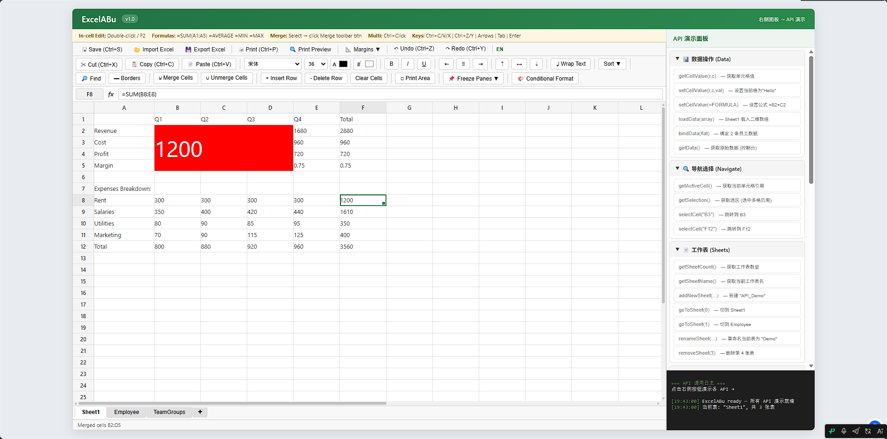

# ExcelABu

> 纯 JavaScript / HTML 实现的 Excel 风格电子表格组件，无需任何第三方框架。零依赖、可嵌入、功能完整。

---
## 演示


在线演示地址：
https://abu-19950821.github.io/EXCELABu/

[](https://gitdiagram.com/abu-19950821/excelabu?utm_source=readme&utm_medium=badge)

## 目录

- [简介](#简介)
- [快速开始](#快速开始)
- [架构概览](#架构概览)
- [目录结构](#目录结构)
- [配置选项](#配置选项)
- [API 参考](#api-参考)
- [调用实例](#调用实例)
  - [基础用法](#基础用法)
  - [数据加载](#数据加载)
  - [数据绑定](#数据绑定)
  - [公式使用](#公式使用)
  - [导入导出](#导入导出)
  - [事件回调](#事件回调)
  - [撤销重做](#撤销重做)
- [国际化](#国际化)
- [浏览器兼容性](#浏览器兼容性)

---

## 简介

ExcelABu 是一个轻量级的、功能齐全的电子表格 Web 组件。它使用纯 JavaScript 编写，采用 **Mixin 模式** 组合各个功能模块，支持：

- 单元格编辑（双击或 F2 进入编辑）
- 公式计算（SUM、AVERAGE、MIN、MAX、IF、CONCAT 等）
- 单元格样式（字体、字号、颜色、背景、边框、对齐）
- 单元格合并与取消合并
- 行/列插入与删除
- 行列宽高调整
- 冻结窗格（冻结行/列）
- 数据排序
- 查找替换
- 剪贴板操作（复制/剪切/粘贴）
- 撤销/重做（每张工作表独立历史栈）
- 多选（Ctrl+点击）
- 多工作表管理
- XLSX 导入导出（基于 SheetJS）
- 打印预览
- 国际化（中/英）
- 对象数组绑定（bindData）
- 填充柄

---

## 快速开始

### 方式一：直接引入

```html
<!DOCTYPE html>
<html lang="zh-CN">
<head>
  <meta charset="UTF-8">
  <link rel="stylesheet" href="css/excelabu.css">
</head>
<body>
  <div id="spreadsheet" style="width:100%;height:600px;"></div>

  <script type="module">
    import { ExcelABu } from './js/excelabu.js';

    const sheet = new ExcelABu('#spreadsheet', {
      rows: 100,
      cols: 26,
      defaultColWidth: 80,
      defaultRowHeight: 24
    });

    sheet.loadData([
      ['项目', 'Q1', 'Q2', 'Q3', 'Q4'],
      ['收入', 1200, 1500, 1800, 2000],
      ['支出', 800,  900,  1000, 1200],
      ['利润', '=B2-B3', '=C2-C3', '=D2-D3', '=E2-E3']
    ]);
  </script>
</body>
</html>
```

### 方式二：作为 ES Module 引入

```javascript
import { ExcelABu } from './js/excelabu.js';

const container = document.getElementById('my-spreadsheet');
const sheet = new ExcelABu(container, {
  rows: 50,
  cols: 16,
  sheetName: 'Report'
});
```

---

## 架构概览

ExcelABu 采用 **Mixin 组合模式** 设计。核心类 `ExcelABu` 通过 `Object.defineProperties` 将 12 个 Mixin 模块的属性挂载到原型上，形成一个功能完整的电子表格实例。

```
ExcelABu (主类)
├── CoreMixin                  核心功能
│   ├── CoreInitMixin         初始化、状态管理
│   ├── CoreDOMMixin          DOM 构建（菜单栏、工具栏、公式栏、网格容器）
│   ├── CoreBindEventsMixin   事件绑定（点击、输入、滚动）
│   ├── CoreActionMixin       动作分发
│   └── CoreSaveMixin         保存功能
├── ToolbarMixin              工具栏子菜单
│   ├── BorderMenuMixin       边框菜单
│   ├── FreezeMenuMixin       冻结菜单
│   └── SortMenuMixin         排序菜单
├── EventsMixin               事件处理
│   ├── EventsMouseMixin      鼠标事件
│   ├── EventsKeyboardMixin   键盘事件
│   └── EventsResizeMixin     调整大小事件
├── EditingMixin              单元格编辑 & 公式栏
├── SelectionMixin            选区管理（多选、行列选择）
├── RenderingMixin            渲染引擎
│   ├── RenderingGridMixin    网格渲染（HTML 字符串拼接 → innerHTML）
│   ├── RenderingFrozenMixin  冻结面板渲染
│   └── RenderingCellMixin    单元格样式渲染
├── ClipboardMixin            剪贴板（复制/剪切/粘贴 + 右键菜单）
├── HistoryMixin              撤销/重做（每张表独立栈）
├── OperationsMixin           操作层
│   ├── OperationsSheetMixin      工作表管理（添加/删除/切换/重命名）
│   ├── OperationsShareMixin      共享样式操作（加粗/斜体/对齐等）
│   ├── OperationsFreezeMixin     冻结窗格
│   ├── OperationsSortMixin       排序
│   ├── OperationsMergeMixin      合并单元格
│   ├── OperationsInsertDeleteMixin 行列插入/删除
│   ├── OperationsClearMixin      清除内容
│   ├── OperationsStylesMixin     样式设置
│   ├── OperationsBordersMixin    边框设置
│   ├── OperationsFillHandleMixin 填充柄
│   ├── OperationsFindReplaceMixin 查找替换
│   └── OperationsConditionalMixin 条件格式
├── PublicMixin                公开 API
├── ImportMixin                导入导出（XLSX）
└── PrintMixin                 打印预览
```

### 数据模型

- **Sheet 类**：单张工作表的数据模型。使用稀疏矩阵存储，`_data` 属性为 `{ "row,col": CellObject }` 格式。
- **CellObject**：`{ value, formula, display, _style }`，其中 `formula` 为不含 `=` 前缀的公式字符串。
- **FormulaEvaluator**：递归下降表达式求值器，支持单元格引用解析、函数调用、算术运算和循环引用检测。
- **MergedCells**：`{ "row,col": { r1, c1, r2, c2 } }`，仅合并区域的左上角存储完整范围，配合 `_mergeIndex` 实现 O(1) 查询。

### 渲染管线

1. `_ensureGridSize()` 根据数据量和可视区域自动扩展行列数
2. 使用字符串拼接构建完整的 `<table>` HTML（含 `colgroup`、`colspan`、`rowspan`）
3. 一次 `innerHTML` 注入，避免频繁 DOM 操作
4. 建立 `_cellDOM` 缓存（`{ "row,col": HTMLElement }`）供选区高亮和局部更新

### History（撤销/重做）

- 每张工作表拥有独立的 `undoStack` 和 `redoStack`
- 快照内容包括：数据、列宽、行高、合并信息、行列数
- 默认栈深度限制：50 步（可通过 `config/constants.js` 中的 `HISTORY.UNDO_STACK_LIMIT` 调整）

---

## 目录结构

```
excelabu/
├── index.html                 # 演示页面（含完整 API 调测面板）
├── config/
│   ├── constants.js           # 全局常量（打印、UI、历史、导入、语言）
│   ├── fonts.js               # 字体列表与字号预设
│   ├── i18n.js                # 国际化定义
│   ├── index.js               # config 入口
│   └── theme.js               # 主题常量（颜色、网格、默认选项）
├── css/
│   ├── excelabu.css           # 主样式表（网格、工具栏、菜单、对话框）
│   └── fonts.css              # 字体图标样式
├── js/
│   ├── excelabu.js            # 主入口：ExcelABu 类定义 + Mixin 组合
│   ├── xlsx.js                # SheetJS 库加载器（动态加载 js-xlsx）
│   └── src/
│       ├── core/
│       │   ├── index.js       # CoreMixin 组合入口
│       │   ├── init.js        # CoreInitMixin：初始化流程
│       │   ├── dom.js         # CoreDOMMixin：DOM 构建
│       │   ├── bind_events.js # CoreBindEventsMixin：事件绑定
│       │   ├── action.js      # CoreActionMixin：动作分发
│       │   └── save.js        # CoreSaveMixin：保存回调
│       ├── events/
│       │   ├── index.js       # EventsMixin 组合入口
│       │   ├── mouse.js       # 鼠标事件处理
│       │   ├── keyboard.js    # 键盘事件处理
│       │   └── resize.js      # 列/行拖拽调整大小
│       ├── operations/
│       │   ├── index.js       # OperationsMixin 组合入口
│       │   ├── borders.js     # 边框操作
│       │   ├── clear.js       # 清除内容
│       │   ├── conditional.js # 条件格式
│       │   ├── fill_handle.js # 填充柄
│       │   ├── find_replace.js# 查找替换
│       │   ├── freeze.js      # 冻结窗格
│       │   ├── insert_delete.js # 行列插入/删除
│       │   ├── merge.js       # 合并/取消合并
│       │   ├── share.js       # 共享样式操作
│       │   ├── sheet.js       # 工作表管理
│       │   ├── sort.js        # 排序
│       │   └── styles.js      # 样式设置
│       ├── rendering/
│       │   ├── index.js       # RenderingMixin 组合入口
│       │   ├── cell.js        # 单元格样式渲染
│       │   ├── frozen.js      # 冻结面板渲染
│       │   └── grid.js        # 网格渲染
│       ├── toolbar/
│       │   ├── index.js       # ToolbarMixin 组合入口
│       │   ├── border_menu.js # 边框下拉菜单
│       │   ├── freeze_menu.js # 冻结下拉菜单
│       │   └── sort_menu.js   # 排序下拉菜单
│       ├── clipboard.js       # 剪贴板（复制/剪切/粘贴/右键菜单）
│       ├── editing.js         # 单元格编辑器 & 公式栏
│       ├── formula.js         # 公式求值器（FormulaEvaluator）
│       ├── history.js         # 撤销/重做
│       ├── i18n.js            # I18N 工具函数
│       ├── import.js          # XLSX 导入导出
│       ├── print.js           # 打印预览
│       ├── public.js          # 公开 API 实现
│       ├── selection.js       # 选区管理
│       ├── sheet.js           # Sheet 数据模型类
│       ├── utils.js           # 工具函数（单元格引用转换、深度克隆、HTML 转义）
│       └── xlsx_export.js     # XLSX 导出自定义 XML 生成器
└── README.md
```

---

## 配置选项

### 构造参数

| 参数 | 类型 | 默认值 | 说明 |
|------|------|--------|------|
| `rows` | `number` | `100` | 初始行数 |
| `cols` | `number` | `26` | 初始列数 |
| `defaultColWidth` | `number` | `100` | 默认列宽（px） |
| `defaultRowHeight` | `number` | `24` | 默认行高（px） |
| `sheetName` | `string` | `'Sheet1'` | 初始工作表名称 |

### 全局常量（`config/constants.js`）

| 常量 | 说明 | 默认值 |
|------|------|--------|
| `HISTORY.UNDO_STACK_LIMIT` | 撤销栈深度 | `50` |
| `IMPORT.MAX_ROWS` | 导入最大行数 | `500` |
| `IMPORT.EXTRA_ROWS` | 导入额外扩展行数 | `20` |
| `UI.DRAG_THRESHOLD` | 拖拽阈值（px） | `4` |
| `UI.COPY_INDICATOR_DURATION` | 复制指示器显示时长（ms） | `2000` |
| `UI.BLUR_COMMIT_DELAY` | 编辑器失焦提交延迟（ms） | `100` |
| `LOCALE.DEFAULT_LANG` | 默认语言 | `'zh'` |
| `PRINT.MARGIN_PRESETS` | 打印边距预设 | `{ normal, narrow, wide }` |

### 网格常量（`config/theme.js`）

| 常量 | 默认值 | 说明 |
|------|--------|------|
| `GRID.ROW_HEADER_WIDTH` | `46` | 行号区域宽度（px） |
| `GRID.COL_HEADER_HEIGHT` | `24` | 列号区域高度（px） |
| `GRID.MIN_COL_WIDTH` | `30` | 最小列宽（px） |
| `GRID.MIN_ROW_HEIGHT` | `16` | 最小行高（px） |
| `GRID.EXPAND_BUFFER` | `10` | 自动扩展缓冲行/列数 |

---

## API 参考

### 数据操作

| 方法 | 说明 |
|------|------|
| `getCellValue(row, col)` | 获取单元格**显示值**（公式自动求值） |
| `setCellValue(row, col, value)` | 设置单元格值。以 `=` 开头的值被识别为公式 |
| `getData()` | 获取当前工作表原始数据映射 |
| `setData(data)` | 设置当前工作表原始数据 |
| `loadData(data, [target])` | 将二维数组载入工作表，自动识别公式/数字/字符串 |
| `bindData(spec)` | 将对象数组绑定到工作表（含列定义、表头、样式、分组） |

### 导航与选择

| 方法 | 说明 |
|------|------|
| `getActiveCell()` | 返回当前单元格引用（如 `"A1"`） |
| `getSelection()` | 返回选区范围 `{ start: "A1", end: "C3" }` |
| `selectCell(ref)` | 选中指定单元格（如 `"B2"`） |
| `selectRange(ref)` | 框选指定范围（如 `"B2:C5"`） |

### 工作表管理

| 方法 | 说明 |
|------|------|
| `getSheetCount()` | 获取工作表总数 |
| `getSheetName()` | 获取当前工作表名称 |
| `addSheet(name)` | 添加工作表，返回索引 |
| `addNewSheet(name)` | 添加工作表并切换过去 |
| `goToSheet(index)` | 切换到指定索引的工作表 |
| `switchSheet(index)` | `goToSheet` 的别名 |
| `removeSheet(index)` | 删除指定索引的工作表 |
| `renameSheet(name)` | 重命名当前工作表 |

### 行列操作

| 方法 | 说明 |
|------|------|
| `setColWidth(col, width)` | 设置列宽（px），col 为 0 起始索引 |
| `setRowHeight(row, height)` | 设置行高（px） |
| `insertRow()` | 在活动格上方插入一行 |
| `deleteRow()` | 删除活动格所在行 |
| `insertCol()` | 在活动格左侧插入一列 |
| `deleteCol()` | 删除活动格所在列 |

### 单元格操作

| 方法 | 说明 |
|------|------|
| `mergeSelection()` | 合并当前选区 |
| `unmergeSelection()` | 取消当前格所在的合并 |
| `clearCells()` | 清空选区内容 |

### 剪贴板

| 方法 | 说明 |
|------|------|
| `copy()` | 复制选区内数据（同时写入系统剪贴板 TSV 格式） |
| `cut()` | 剪切选区内数据 |
| `paste()` | 从内部剪贴板粘贴数据 |

### 撤销重做

| 方法 | 说明 |
|------|------|
| `undo()` | 撤销上一步操作 |
| `redo()` | 重做已撤销的操作 |

### 导入导出

| 方法 | 说明 |
|------|------|
| `importFile()` | 打开文件对话框导入 XLSX/XLS/CSV |
| `importFromUrl(url, [opts])` | 从服务器 URL 拉取并导入 XLSX |
| `exportFile()` | 导出并下载当前工作簿为 XLSX（含样式） |
| `onSave(callback)` | 注册保存回调（菜单栏保存按钮触发） |

### 组件控制

| 方法 | 说明 |
|------|------|
| `refresh()` | 强制刷新整个表格 |
| `destroy()` | 销毁组件，清空容器，移除事件监听 |

---

## 调用实例

### 基础用法

```javascript
import { ExcelABu } from './js/excelabu.js';

// 方式一：传入选择器字符串
const sheet = new ExcelABu('#spreadsheet', {
  rows: 50,
  cols: 16
});

// 方式二：传入 DOM 元素
const container = document.getElementById('my-sheet');
const sheet2 = new ExcelABu(container, {
  rows: 200,
  cols: 52,       // AZ 列
  defaultColWidth: 90,
  defaultRowHeight: 28,
  sheetName: 'MySheet'
});
```

### 数据加载

#### loadData — 二维数组

```javascript
sheet.loadData([
  ['',        'Q1',    'Q2',    'Q3',    'Total'],
  ['Revenue', 1200,    1500,    1800,    '=SUM(B2:D2)'],
  ['Cost',    800,     900,     1000,    '=SUM(B3:D3)'],
  ['Profit',  '=B2-B3','=C2-C3','=D2-D3','=SUM(B4:D4)']
]);
```

支持自动类型识别：

| 输入值 | 类型 |
|--------|------|
| `'Hello'` | 字符串文本 |
| `1200` | 数字 |
| `'=SUM(A1:A5)'` | 公式 |
| `true` | 布尔值 |
| `null / undefined / ''` | 跳过（不写入） |

#### loadData 到指定工作表

```javascript
// 按索引（0 起始）
sheet.loadData(data, 1);

// 按工作表名称
sheet.loadData(data, 'Employee');
```

#### getData / setData — 原始数据映射

```javascript
// 获取原始数据
const rawData = sheet.getData();
// 返回: { "0,0": { value: 'Revenue' }, "0,1": { value: 1200, formula: null }, ... }

// 还原数据
sheet.setData(rawData);
```

### 数据绑定（bindData）

`bindData` 是 ExcelABu 的特色功能，支持将对象数组自动渲染为表格，包含列定义、样式、表头。

#### 平面数据绑定

```javascript
sheet.bindData({
  sheetName: 'Employee',        // 可选，自动创建并切换到该工作表
  startRow: 0,                  // 起始行（0 起始）
  startCol: 0,                  // 起始列（0 起始）
  columns: [
    { key: 'id',     title: 'ID',       width: 60,  style: { align: 'center' } },
    { key: 'name',   title: 'Name',     width: 100 },
    { key: 'dept',   title: 'Department', width: 120 },
    { key: 'salary', title: 'Salary',   width: 90,  style: { align: 'right', numberFormat: '#,##0' } }
  ],
  data: [
    { id: 1001, name: 'Alice',   dept: 'Engineering', salary: 8500 },
    { id: 1002, name: 'Bob',     dept: 'Design',      salary: 7200 },
    { id: 1003, name: 'Charlie', dept: 'Engineering', salary: 9000 }
  ]
});
```

#### 分组数据绑定（主从结构）

当数据对象包含 `items` 子数组时，`group: true` 的列会自动跨行合并：

```javascript
sheet.bindData({
  sheetName: 'TeamGroups',
  columns: [
    { key: 'id',   title: 'ID',   width: 60,  group: true, style: { align: 'center' } },
    { key: 'note', title: 'Note', width: 180, group: true, style: { valign: 'top' } },
    { key: 'name', title: 'Name', width: 100 },
    { key: 'dept', title: 'Dept', width: 120 }
  ],
  data: [{
    id: 1001,
    note: 'Team lead\n5 years',
    items: [
      { name: 'Alice',   dept: 'Engineering' },
      { name: 'Bob',     dept: 'Design' },
      { name: 'Charlie', dept: 'Engineering' }
    ]
  }]
});
```

### 公式使用

#### 支持的函数

| 函数 | 说明 |
|------|------|
| `SUM(range)` | 求和 |
| `AVERAGE(range)` / `AVG(range)` | 求平均值 |
| `MIN(range)` | 最小值 |
| `MAX(range)` | 最大值 |
| `COUNT(range)` | 计数（仅数字） |
| `COUNTA(range)` | 计数（非空） |
| `IF(condition, trueVal, falseVal)` | 条件判断 |
| `CONCAT(val1, val2, ...)` / `CONCATENATE` | 字符串拼接 |
| `UPPER(text)` | 转大写 |
| `LOWER(text)` | 转小写 |
| `TRIM(text)` | 去除首尾空格 |
| `ABS(num)` | 绝对值 |
| `ROUND(num)` | 四舍五入 |
| `ROUNDUP(num)` | 向上取整 |
| `ROUNDDOWN(num)` | 向下取整 |

#### 公式示例

```javascript
// 算术运算
sheet.setCellValue(0, 0, '=A1+B1*2');
sheet.setCellValue(0, 1, '=(C1+D1)/E1');

// 函数调用
sheet.setCellValue(0, 2, '=SUM(A1:A10)');
sheet.setCellValue(0, 3, '=IF(B2>100, "High", "Low")');
sheet.setCellValue(0, 4, '=AVERAGE(B2:D2)');
sheet.setCellValue(0, 5, '=CONCAT(A1, " - ", B1)');

// 混合引用
sheet.setCellValue(1, 0, '=SUM(A1:A5)*2 + MAX(B1:B5)');
```

#### 循环引用保护

公式求值器内置循环引用检测，当检测到循环依赖时返回 `#CIRC!`。

```javascript
sheet.setCellValue(0, 0, '=A1');  // 单元格引用自身 → #CIRC!
sheet.setCellValue(0, 1, '=A2');  // A2 引用 A1
sheet.setCellValue(1, 0, '=B1');  // B1 引用 A2 → 循环引用链
```

### 导入导出

#### 导出 XLSX

```javascript
// 一键导出（含样式）
sheet.exportFile();
// 浏览器将自动下载 spreadsheet.xlsx
```

#### 导入 XLSX

```javascript
// 打开文件选择对话框
sheet.importFile();

// 从服务器 URL 导入
await sheet.importFromUrl('https://example.com/data.xlsx');

// 带自定义请求头的 URL 导入
await sheet.importFromUrl('https://api.example.com/report.xlsx', {
  headers: { 'Authorization': 'Bearer token123' },
  credentials: 'include'
});
```

#### 保存回调（onSave）

```javascript
sheet.onSave(function(blob, allData, instance) {
  // blob:    XLSX 文件的 Blob 对象
  // allData: 所有工作表数据集合
  //   {
  //     "Sheet1": [["A1","B1"],["A2","B2"]],           // 二维数组
  //     "Employee": [{id:1,name:"Alice"},{...}]          // 有 columns 的 → 对象数组
  //   }
  // instance: ExcelABu 实例

  // 上传到服务器
  const formData = new FormData();
  formData.append('file', blob, 'spreadsheet.xlsx');
  fetch('https://api.example.com/upload', {
    method: 'POST',
    body: formData
  });

  console.log('Saved! Total sheets:', Object.keys(allData).length);
});
```

### 事件回调

```javascript
// 监听保存事件
sheet.onSave(function(blob, data, inst) {
  console.log('保存触发，数据大小:', blob.size);
});
```

### 撤销重做

```javascript
sheet.undo();  // 撤销
sheet.redo();  // 重做
```

每张工作表的撤销栈相互独立，切换工作表不会丢失历史记录。默认最多保留 50 步。

### 样式操作

```javascript
// 设置字体样式（通过选区）
// 也可通过工具栏 UI 操作

// 设置列宽
sheet.setColWidth(0, 120);   // A 列宽 120px
sheet.setColWidth(2, 200);   // C 列宽 200px

// 设置行高
sheet.setRowHeight(0, 40);   // 第 1 行高 40px
```

### 完整生命周期

```javascript
// 创建
const sheet = new ExcelABu('#app', { rows: 100, cols: 20 });

// 使用
sheet.loadData(data);
sheet.addNewSheet('Summary');
sheet.selectCell('B2');

// 销毁
sheet.destroy();  // 移除事件监听，清空容器，防止内存泄漏
```

---

## 国际化

ExcelABu 内置中英文双语支持，语言检测优先级：

1. `localStorage` 中存储的语言偏好（key: `excelabu_lang`）
2. 默认语言：中文

```javascript
// 通过 localStorage 切换语言
localStorage.setItem('excelabu_lang', 'en');
location.reload();  // 刷新后生效
```

工具栏、菜单栏、右键菜单、对话框的文案均支持国际化。如需添加新语言，在 `config/i18n.js` 中添加对应语种翻译对象即可。

---

## 浏览器兼容性

| 浏览器 | 支持情况 |
|--------|----------|
| Chrome 80+ | 完全支持 |
| Firefox 80+ | 完全支持 |
| Safari 14+ | 完全支持 |
| Edge 80+ | 完全支持 |
| IE 11 | 不支持（依赖现代 ES 特性和 CSS 特性） |

### 依赖

- **SheetJS (xlsx)**：导入导出功能依赖 `js-xlsx` 库。该库在首次调用 `importFile` / `exportFile` / `importFromUrl` 时通过动态 `<script>` 标签加载（CDN: `https://cdn.sheetjs.com/xlsx-0.20.1/package/dist/xlsx.full.min.js`）。
- **无其他第三方依赖**：核心表格功能完全零依赖。

---

## License

MIT